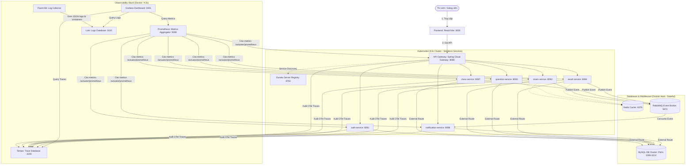

# E-Mid Quiz System — DevOps & Observability Infrastructure

Tài liệu này tập trung vào thiết kế kiến trúc hạ tầng, quy trình tích hợp/triển khai liên tục (CI/CD) và hệ thống giám sát khả năng quan sát (Observability Stack) của dự án **E-Mid Quiz System**.

---

## 1. Sơ đồ Kiến trúc Tổng thể (System Architecture)

Hệ thống được thiết kế theo kiến trúc Microservices chạy trên môi trường lai (Hybrid): Các dịch vụ ứng dụng và giám sát chạy trong cụm **Kubernetes (K3s)**, trong khi các cơ sở dữ liệu và hạ tầng trung gian chạy trực tiếp trên **Docker Host** bên ngoài để đảm bảo tính an toàn dữ liệu.



---

## 2. Hướng dẫn Triển khai ở Môi trường Phát triển (Local Development)

### 2.1 Chuẩn bị tệp môi trường `.env`
Sao chép tệp mẫu cấu hình sang `.env` và thiết lập các tham số về mật khẩu, cổng kết nối, API Key cho AI (Gemini, OpenAI) và cấu hình gửi Email:
```bash
cp .env.example .env
```
*(Lưu ý: Tệp `.env` đã được cấu hình trong `.gitignore` để đảm bảo bảo mật và không bị đẩy lên GitHub).*

### 2.2 Khởi chạy bằng Docker Compose
Dự án cung cấp hai tệp compose để khởi chạy linh hoạt:

* **Phương án 1: Chỉ chạy hạ tầng nền tảng (Database, Middleware, Monitoring)**
  Phù hợp khi bạn muốn tự chạy và debug các dịch vụ Spring Boot/React bằng IDE dưới local:
  ```bash
  docker compose -f docker-compose-infra.yml up -d
  ```

* **Phương án 2: Chạy toàn bộ hệ thống (Cả hạ tầng lẫn ứng dụng)**
  Dựng đầy đủ tất cả các dịch vụ nghiệp vụ và giao diện người dùng:
  ```bash
  docker compose up --build -d
  ```

---

## 3. Triển khai Production trên cụm Kubernetes (K3s)

Thư mục `k8s/` chứa toàn bộ các file khai báo tài nguyên (manifests) chạy trên production:

### 3.1 Liên kết Cơ sở Dữ liệu Ngoài cụm (External Services Routing)
Để tránh rủi ro mất mát dữ liệu và quá tải khi chạy Database trong Kubernetes, toàn bộ cơ sở dữ liệu MySQL được chạy ở ngoài cụm (trên Docker Host của VM GCP). 
Dự án sử dụng cấu hình **Selector-less Service** kết hợp với **Endpoints** thủ công trong [k8s/external-services.yaml](file:///c:/mid-project-135890-main/k8s/external-services.yaml):
* **Service:** Định nghĩa một Hostname nội bộ (ví dụ: `auth-db`, `question-db`).
* **Endpoints:** Ánh xạ tên Hostname nội bộ này ra địa chỉ IP vật lý của máy ảo (`HOST_IP`) cùng cổng MySQL tương ứng (ví dụ: `3306` cho Auth, `3307` cho Question...).
* **Lợi ích:** Các microservice trong K8s chỉ cần trỏ tới JDBC URL dạng `jdbc:mysql://auth-db:3306/...` mà không cần biết địa chỉ IP thật của máy chủ bên ngoài.

### 3.2 Bảo mật Khóa và Mật khẩu (Kubernetes Secrets)
Để vượt qua cơ chế kiểm duyệt bảo mật của GitHub (không lộ khóa API của Gemini và OpenAI trên git), dự án sử dụng đối tượng **Kubernetes Secret** tên là `quiz-secrets`:
* Trong [k8s/services.yaml](file:///c:/mid-project-135890-main/k8s/services.yaml), các khóa nhạy cảm được nạp động từ Secret thông qua `valueFrom`:
  ```yaml
  - name: GEMINI_API_KEY
    valueFrom:
      secretKeyRef:
        name: quiz-secrets
        key: GEMINI_API_KEY
  ```
* Secret `quiz-secrets` sẽ được tạo và đồng bộ tự động bởi quy trình CI/CD từ tệp `.env` an toàn trên VM trước mỗi lượt deploy.

---

## 4. Quy trình Tích hợp và Triển khai liên tục (CI/CD Pipeline)

Toàn bộ quy trình được tự động hóa qua tệp [.gitlab-ci.yml](file:///c:/mid-project-135890-main/.gitlab-ci.yml) trên GitLab CE nội bộ:

```
[ Commit / Merge Request ]
           │
           ▼
┌──────────────────────────────────────┐
│ STAGE 1: Test & Quality Gate         │ ──► Chạy Unit Test trên Runner, nếu có
└──────────────────────────────────────┘     lỗi sẽ BLOCK tiến trình merge/triển khai.
           │
           ▼
┌──────────────────────────────────────┐
│ STAGE 2: Build & Package Docker      │ ──► Build Multi-stage image và gắn tag Commit SHA,
└──────────────────────────────────────┘     đăng nhập và push lên Harbor Private Registry.
           │
           ▼
┌──────────────────────────────────────┐
│ STAGE 3: Deploy to K3s               │ ──► 1. Đồng bộ tệp .env thành K8s Secret.
└──────────────────────────────────────┘     2. Áp dụng manifest và Rolling Update không downtime.
```

### Chi tiết các Stage:
1. **Stage `test`:**
   Chạy lệnh `mvn clean test` cho từng dịch vụ. Một tập lệnh **Quality Gate** (chốt chặn chất lượng) bằng Bash script sẽ kiểm tra mã lỗi thoát (Exit Code) để đưa ra quyết định có cho phép Merge Code hay không.
2. **Stage `build`:**
   Docker CLI sẽ tự động thực hiện build và đóng gói ứng dụng. Sau đó đăng nhập và đẩy (push) image lên **Harbor Private Registry** đặt tại `35.185.187.150:8000`.
3. **Stage `deploy`:**
   * Tự động tạo/đồng bộ Secret bằng lệnh:
     `kubectl create secret generic quiz-secrets --from-env-file=.env --dry-run=client -o yaml | kubectl apply -f -`
   * Áp dụng cấu hình Manifests mới nhất lên cụm: `kubectl apply -f k8s/services.yaml`
   * Triển khai cập nhật cuốn chiếu không gây gián đoạn dịch vụ (**Zero-Downtime Rolling Update**) bằng lệnh:
     `kubectl rollout restart deployment/<service-name>`

---

## 5. Hệ thống Giám sát & Phân tích lỗi (Observability Stack)

Hệ thống cung cấp khả năng quan sát toàn diện trạng thái vận hành của các Microservices thông qua **3 trụ cột dữ liệu (Telemetry Data)** tích hợp về Grafana Dashboard:

### 5.1 Metrics (Prometheus)
* Các dịch vụ Spring Boot mở cổng đo lường hiệu năng `/actuator/prometheus` thông qua thư viện Micrometer.
* **Prometheus** định kỳ 15 giây cào (Pull-based) dữ liệu về để giám sát sức khỏe dịch vụ, tỷ lệ lỗi (Error Rate) và thời gian phản hồi (Latency/Duration) theo mô hình đo lường **RED Method**.

### 5.2 Centralized Logging (Loki & Fluent Bit)
* **Log có cấu trúc (Structured Logging):** Các Java service được cấu hình sử dụng Logback để xuất ra log có cấu trúc dạng **JSON** gồm các trường `@timestamp`, `level`, `service_name`, `trace_id`, `span_id` và `message`.
* **Thu thập Log:** **Fluent Bit** chạy dưới dạng log agent, tự động đọc tệp tin log của các container, phân tích cấu trúc JSON và đẩy về **Loki Backend** tập trung (Port 3100).

### 5.3 Distributed Tracing (Tempo & OpenTelemetry)
* Dự án tích hợp **OpenTelemetry Java Agent** (`opentelemetry-javaagent.jar`) chạy ngầm cùng JVM của mỗi service.
* Agent này tự động bắt các cuộc gọi mạng HTTP/gRPC, các truy vấn cơ sở dữ liệu (SQL queries), tự động sinh ra `Trace ID` và đẩy dữ liệu vết về **Tempo Backend** (cổng 4318 OTLP HTTP / 4317 OTLP gRPC).
* **Lan truyền ngữ cảnh (Context Propagation):** Tracing context được lan truyền xuyên suốt qua các service thông qua HTTP Header chuẩn W3C (`traceparent`).

### 5.4 Liên kết Dữ liệu (Correlation) để Khắc phục Sự cố (Debug)
Dữ liệu được liên kết chặt chẽ trên Grafana bằng cách sử dụng **Trace ID**:
1. **Metrics:** Giúp nhận diện và phát hiện hệ thống đang gặp lỗi (Ví dụ: Thấy biểu đồ Error Rate tăng đột biến ở API Gateway).
2. **Tempo (Traces):** Bấm vào điểm lỗi trên biểu đồ để nhảy sang giao diện Tracing. Biểu đồ thác nước (Waterfall Chart) của Tempo sẽ chỉ rõ request đó đi qua những service nào và bị tắc nghẽn/timeout ở service nào (Ví dụ: Lỗi nghẽn tại `result-service`).
3. **Loki (Logs):** Từ vết lỗi trên Tempo, hệ thống tự động lọc ra toàn bộ log của các service có chung `Trace ID` tương ứng để chỉ ra nguyên nhân chi tiết (Ví dụ: Log chỉ rõ lỗi `Connection Timeout` khi kết nối vào cơ sở dữ liệu MySQL).
