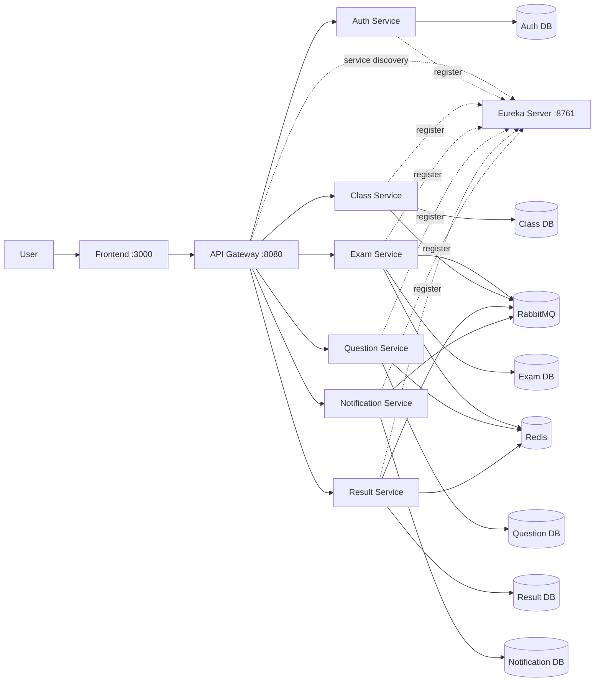

# E-Mid Quiz System

[](https://github.com/hungdn1701/microservices-assignment-starter/stargazers)
[](https://github.com/hungdn1701/microservices-assignment-starter/network/members)
[](LICENSE)

> Một nền tảng thi trắc nghiệm giữa kỳ dựa trên kiến trúc microservices, hỗ trợ quản lý lớp học, ngân hàng câu hỏi, vòng đời bài thi, chấm điểm và thông báo.

---

## Team Members

| Name           | Student ID | Role   | Contribution                                                                                                                                                                               |
|----------------|------------|--------|--------------------------------------------------------------------------------------------------------------------------------------------------------------------------------------|
| Nguyễn Trí Dũng | B22DCCN135 | Leader | Triển khai Auth, Exam, Result, Notification Services. <br/>Triển khai RabbitMQ events, Resilience4j, anti-cheat, OpenFeign, tích hơp Gemini API, OpenAI API. <br/>Code frontend, viết báo cáo |
| Đoàn Thảo Vân | B22DCCN890 | Member | Triển khai Gateway, Eureka, Question, Class Services. <br/> Triển khai Redis caching, tổng hợp Swagger. <br/> Code frontend, viết báo cáo. |

---

## Business Process

**Domain**: Hệ thống Đánh giá và Khảo thí Trực tuyến (Online Education Assessment / E-Learning). Domain này tập trung vào việc số hóa hoàn toàn quy trình kiểm tra, thi giữa kỳ/cuối kỳ (midterm/final) và đánh giá năng lực học viên trong môi trường giáo dục đại học hoặc trung tâm đào tạo. Quá trình này bao gồm việc chuyển đổi từ khâu nghiệp vụ đào tạo như quản lý ngân hàng câu hỏi đa dạng (trắc nghiệm, phân loại category), xây dựng cấu trúc bài thi linh hoạt, quản lý chu kỳ sống (lifecycle) của bài thi, đến việc tự động hóa quá trình giám sát, chấm điểm và trả kết quả. 

**Business process** :
1. **Định danh (Identity)**: Người dùng đăng ký, xác thực email, đăng nhập; giảng viên và sinh viên nhận quyền JWT.
2. **Quản lý lớp học (Class management)**: Giảng viên tạo lớp học và chia sẻ mã tham gia; sinh viên tham gia bằng mã.
3. **Nội dung (Content)**: Giảng viên duy trì **ngân hàng câu hỏi** (CRUD, import, tùy chọn sinh câu hỏi bằng AI).
4. **Vòng đời bài thi (Exam lifecycle)**: Giảng viên tạo bài thi nháp, đính kèm câu hỏi, **xuất bản** (thiết lập thời gian, quy tắc).
5. **Làm bài (Attempt)**: Sinh viên bắt đầu làm bài (server theo dõi phiên qua Redis), trả lời, nộp bài.
6. **Chấm điểm & Toàn vẹn (Scoring & integrity)**: Hệ thống chấm điểm tự động, lưu kết quả và sự kiện **vi phạm** tùy chọn (chống gian lận); nộp bài lũy đẳng.
7. **Thông báo (Notifications)**: Sự kiện (xuất bản bài thi, nộp bài, thêm người dùng vào lớp...) kích hoạt thông báo **trong ứng dụng** (và qua **email** tùy chọn).

**Actors** :
- **Sinh viên (Student)**: Người tiêu thụ nội dung chính. Tham gia lớp học, tiếp nhận bài thi, thực thi bài thi trong thời gian giới hạn và nhận điểm số/thông báo.
- **Giảng viên (Instructor)**: Người hoạch định. Thiết lập khuôn khổ khóa học, phát triển hệ thống câu hỏi, xây dựng luật lệ thi và có quyền truy xuất xem toàn bộ điểm số, vi phạm (reports).
- **Hệ thống (System Automations)**: Các worker ngầm đảm nhiệm chức năng tự chấm điểm, gửi mail bất đồng bộ, dọn dẹp các session hết hạn và ghi log vi phạm.

**Scope** : Chỉ tập trung vào quy trình thi trực tuyến (không bao gồm các tính năng ERP, tuyển sinh hay thư viện). Kiến trúc: frontend (React/Vite) → API gateway → 6 microservices (DB per service) + Redis + RabbitMQ + Eureka.

---

## Architecture



| Component | Responsibility | Tech Stack | Port |
|-----------|----------------|------------|------|
| **Frontend** | Giao diện người dùng cuối | React + Vite + Nginx | 3000 |
| **Gateway** | Điểm trung chuyển, định tuyến, kiểm tra JWT, CORS | Spring Cloud Gateway | 8080 |
| **Eureka Server** | Đăng ký và khám phá dịch vụ | Spring Cloud Netflix Eureka | 8761 |
| **Auth Service** | Đăng ký, đăng nhập, xác minh danh tính | Spring Boot + MySQL | 8081 (internal) |
| **Exam Service** | Quản lý vòng đời và thiết lập bài thi | Spring Boot + MySQL + Redis | 8082 (internal) |
| **Question Service** | Ngân hàng câu hỏi, import, AI tạo câu hỏi | Spring Boot + MySQL + Redis | 8083 (internal) |
| **Result Service** | Chấm điểm, phản hồi và lưu trữ kết quả | Spring Boot + MySQL + Redis | 8084 (internal) |
| **Notification Service** | Xử lý và gửi các sự kiện thông báo | Spring Boot + MySQL + RabbitMQ | 8086 (internal) |
| **Class Service** | Quản lý thông tin lớp học và học viên | Spring Boot + MySQL + RabbitMQ | 8087 (internal) |
| **Redis** | Hỗ trợ lưu trữ cache/session chạy thực | Redis 7 | 6379 |
| **RabbitMQ** | Trục sự kiện giữa các microservices | RabbitMQ 3 Management | 5672 / 15672 |

> Tài liệu tham khảo kiến trúc đầy đủ: [`docs/architecture.md`](docs/architecture.md) · [`docs/analysis-and-design.md`](docs/analysis-and-design.md)

---

## Getting Started

```bash
# Clone và khởi tạo
git clone https://github.com/jnp2018/mid-project-135890.git
cd mid-project-135890
cp .env.example .env

# Build và chạy hệ thống
docker compose up --build
```

### Verify

```bash
# Gateway health
curl http://localhost:8080/actuator/health

# Truy cập bảng điều khiển Eureka bằng trình duyệt
curl http://localhost:8761/

# Kiểm tra trạng thái Public service (được map ra host)
curl http://localhost:8081/health   # Auth Service

# Kiểm tra trạng thái Internal service (chạy curl trong container)
curl http://localhost:8082/health
curl http://localhost:8083/health
curl http://localhost:8084/health
curl http://localhost:8086/health
curl http://localhost:8087/health

# Kiểm tra trạng thái các container docker
docker compose ps
```

---

## API Documentation

### Service API Specifications

- [Auth Service](docs/api-specs/auth-service.yaml) — Đăng ký, đăng nhập vòng đời người dùng, xác thực email
- [Question Service](docs/api-specs/question-service.yaml) — Khởi tạo và quản lý ngân hàng câu hỏi
- [Exam Service](docs/api-specs/exam-service.yaml) — Quản lý vòng đời bài thi, lượt làm bài của sinh viên
- [Result Service](docs/api-specs/result-service.yaml) — Theo dõi kết quả và tính điểm từng bài làm
- [Notification Service](docs/api-specs/notification-service.yaml) — Hệ thống gửi thông báo sự kiện, email cảnh báo
- [Class Service](docs/api-specs/class-service.yaml) — Theo dõi, thêm bớt danh sách thành viên và lớp học

> Danh sách API được liệt kê **theo từng dịch vụ**. Vui lòng sử dụng Swagger UI có sẵn của mỗi dịch vụ để kiểm thử khi chạy tự thân qua local (tham khảo file `readme.md` riêng của dịch vụ).

---

## License

This project uses the [MIT License](LICENSE).

> Template by [Hung Dang](https://github.com/hungdn1701) · [Template guide](GETTING_STARTED.md)
