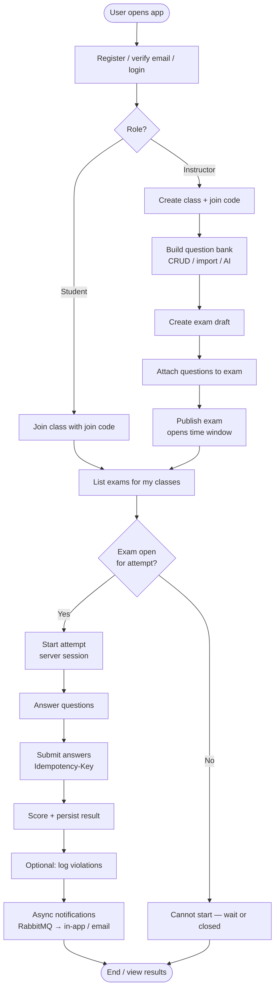
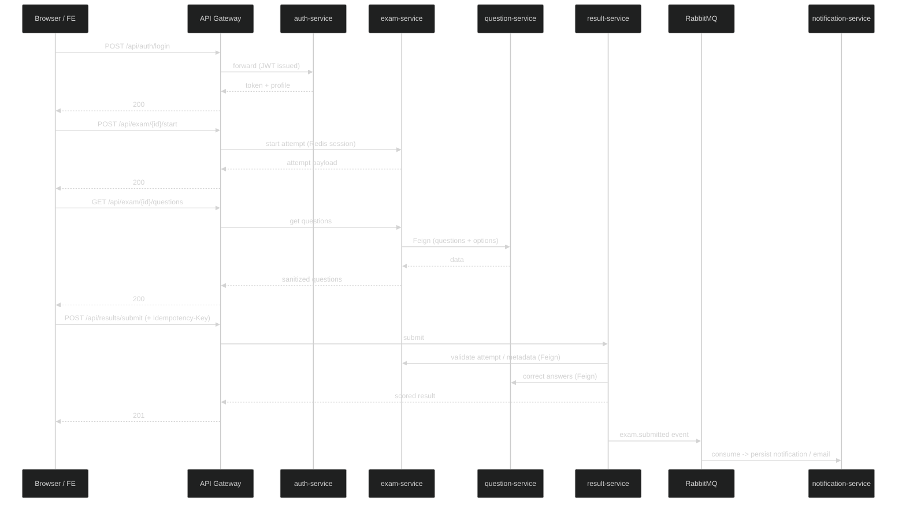
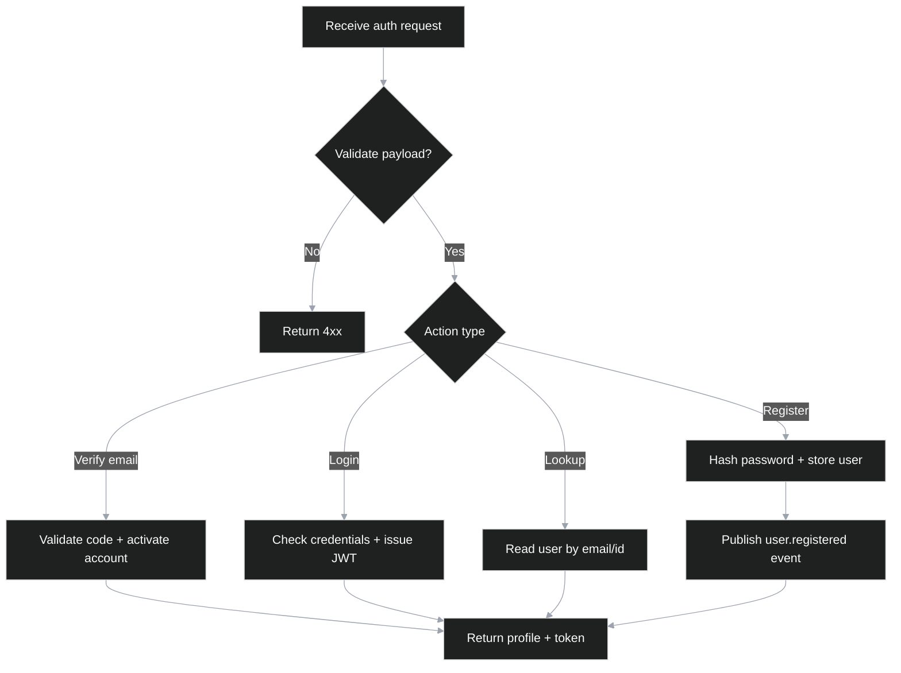
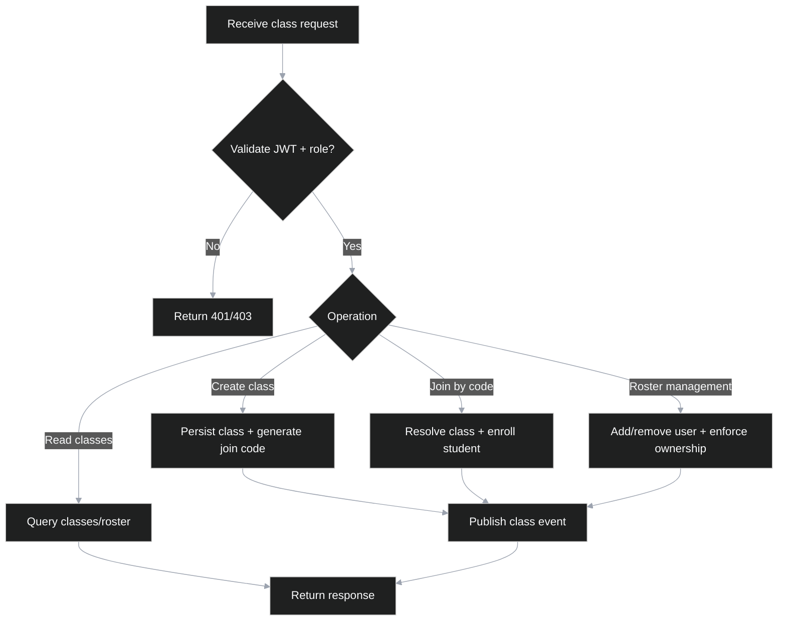
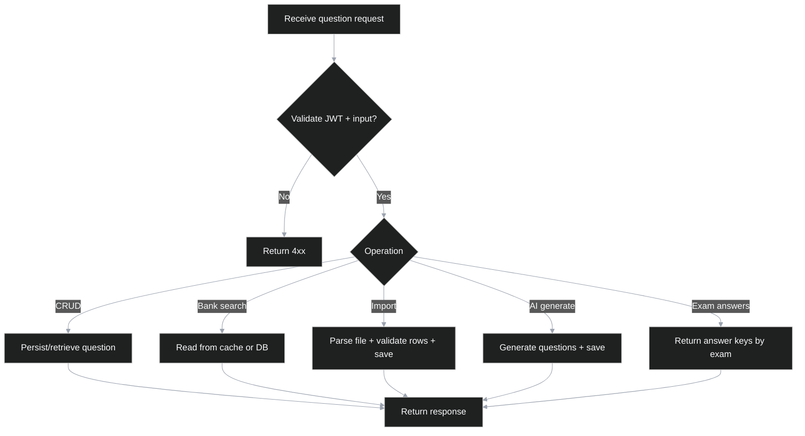
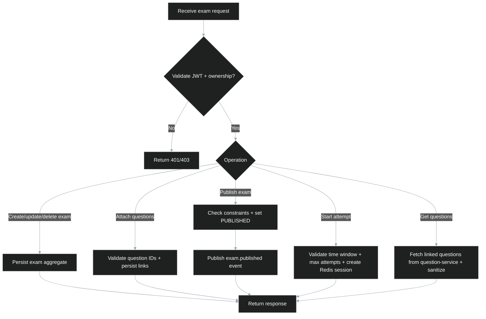
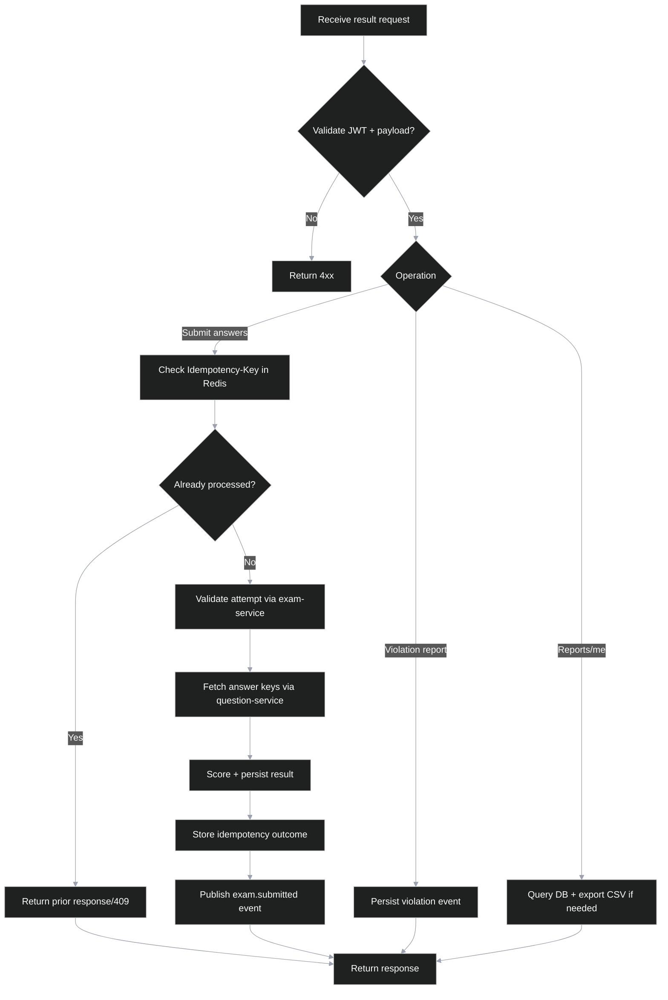
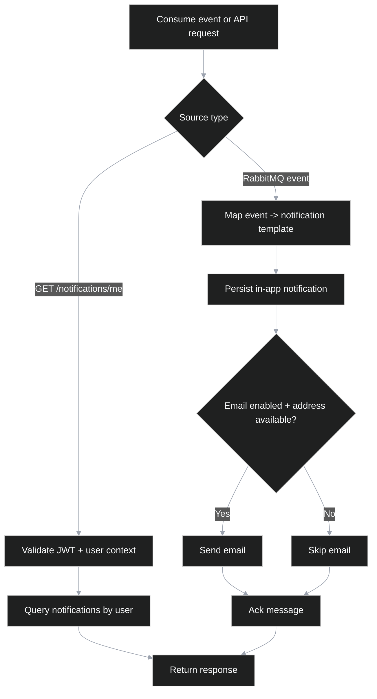

# Analysis and Design — E-Mid Quiz

> **Goal**: Analyze a specific business process and design a service-oriented automation solution (SOA/Microservices).
> **Scope**: One business process — online quiz: classes, exams, attempts, scoring, notifications (not an entire university IS).

**References:**
1. *Service-Oriented Architecture: Analysis and Design for Services and Microservices* — Thomas Erl (2nd Edition)
2. *Microservices Patterns: With Examples in Java* — Chris Richardson
3. *Bài tập — Phát triển phần mềm hướng dịch vụ* — Hung Dang (available in Vietnamese)

---

## Part 1 — Analysis Preparation

### 1.1 Business Process Definition

**Domain**: 
Hệ thống Đánh giá và Khảo thí Trực tuyến (Online Education Assessment / E-Learning). Domain này tập trung vào việc số hóa hoàn toàn quy trình kiểm tra, thi giữa kỳ/cuối kỳ (midterm/final) và đánh giá năng lực học viên trong môi trường giáo dục đại học hoặc trung tâm đào tạo. Quá trình này bao gồm việc chuyển đổi từ khâu nghiệp vụ đào tạo như quản lý ngân hàng câu hỏi đa dạng (trắc nghiệm, phân loại category), xây dựng cấu trúc bài thi linh hoạt, quản lý chu kỳ sống (lifecycle) của bài thi, đến việc tự động hóa quá trình giám sát, chấm điểm và trả kết quả.

**Business process** (high level):
Quy trình nghiệp vụ cốt lõi xuyên suốt hệ thống diễn ra theo các bước sau, với sự tương tác qua lại của nhiều miền dịch vụ (Sub-domains):
1. **Quản lý Định danh & Phân quyền (Identity & Access - Auth Service)**: 
   - Người dùng tiến hành đăng ký tài khoản (Register), hệ thống yêu cầu xác minh qua email (Email Verification logic) để kích hoạt. 
   - Đăng nhập (Login) thành công, hệ thống cấp phát JWT (JSON Web Token) ứng dụng mã hóa (HS256).
   - Hệ thống định nghĩa rạch ròi 2 cấp độ phân quyền (Role-based Access): Giảng viên (Instructor) và Sinh viên (Student).
2. **Quản lý Lớp học (Class Management - Class Service)**: 
   - Giảng viên khởi tạo lớp học mới, cấu hình thông tin mô tả và hệ thống tự động sinh một mã tham gia duy nhất (Unique Join Code).
   - Sinh viên nhập mã này (join with code) để ghi danh (enroll) vào lớp học. Hệ thống lưu trữ ánh xạ (Mapping) giữa User và Class.
3. **Quản trị Ngân hàng Câu hỏi (Question Bank - Question Service)**: 
   - Giảng viên xây dựng và tự chủ kho dữ liệu câu hỏi cá nhân hoặc dùng chung (CRUD).
   - Hỗ trợ phân loại câu hỏi (Category migration), tính năng tải lên hàng loạt từ file hoặc tích hợp AI để sinh câu hỏi tự động.
4. **Vòng đời và Cấu hình Bài thi (Exam Lifecycle - Exam Service)**: 
   - Giảng viên tạo khung bài thi (Draft Exam) trong phạm vi của một lớp học.
   - Bốc tách và liên kết các định danh câu hỏi (Question IDs) từ Question Service vào khung bài thi.
   - Thiết lập cấu hình chuyên sâu: Khung thời gian khả dụng (Open/Close Time window), Giới hạn thời gian làm (Time limit), Số lần cho phép làm lại (Multi-attempt limit).
   - Cuối cùng, thực hiện hành động "Xuất bản" (Publish) - chốt sổ cấu hình và thông báo cho sinh viên liên quan.
5. **Thực thi Đánh giá (Attempting Exam - Result/Exam Service)**: 
   - Sinh viên truy cập bài thi đã mở. Hệ thống kiểm tra điều kiện (còn mốc thời gian, chưa vượt quá số lần thử).
   - Nếu thỏa điều kiện, một phiên làm bài (Session Attempt) được tạo trên server (thường dùng Redis để tracking caching timeout).
   - Sinh viên trả lời các câu hỏi và gửi bài (Submit).
6. **Chấm điểm & Giám sát Vi phạm (Scoring & Integrity - Result Service)**: 
   - Hệ thống tự động đối chiếu Answer Key với bài làm để chấm điểm số (Score Calculation) ngay tức khắc.
   - Ghi nhận và lưu vết các sự kiện vi phạm (Violation logging - ví dụ: rời khỏi tab trình duyệt, vô hiệu hóa toàn màn hình) để phục vụ thanh tra anti-cheat.
   - Tính năng nộp bài được thiết kế theo cơ chế lũy đẳng (Idempotent Submit) qua Idempotency-Key để vô hiệu hóa tình trạng nhấn gửi nhiều lần cùng lúc.
7. **Thông báo và Tương tác (Notifications - Notification Service)**: 
   - Mọi sự kiện nghiệp vụ quan trọng (bài thi vừa xuất bản, nộp bài thành công có điểm, người dùng mới đăng ký,...) đều được Publish dưới dạng Event thông qua RabbitMQ (Message Broker).
   - Notification Service theo dõi (Consume) hàng đợi này và tiến hành phát đi các thông báo trực tuyến nội bộ (In-app) ngay trên giao diện hoặc qua Email (SMTP).

**Actors**: 
- **Sinh viên (Student)**: Người tiêu thụ nội dung chính. Tham gia lớp học, tiếp nhận bài thi, thực thi bài thi trong thời gian giới hạn và nhận điểm số/thông báo.
- **Giảng viên (Instructor)**: Người hoạch định. Thiết lập khuôn khổ khóa học, phát triển hệ thống câu hỏi, xây dựng luật lệ thi và có quyền truy xuất xem toàn bộ điểm số, vi phạm (reports).
- **Hệ thống (System Automations)**: Các worker ngầm đảm nhiệm chức năng tự chấm điểm, gửi mail bất đồng bộ, dọn dẹp các session hết hạn và ghi log vi phạm.

**Scope**: 
Dự án được giới hạn chặt chẽ trong hệ sinh thái mô hình thi và đánh giá trực tuyến (Online Quiz Process), loại trừ hoàn toàn các tính năng ERP, tuyển sinh hay thư viện của trường (University IS). Phạm vi kiến trúc chi tiết gồm:
- **Giao diện Web Front-end**: Xây dựng bằng React/Vite/TypeScript, giao diện responsive, tương tác trực tiếp với API Gateway.
- **API Gateway (Spring Cloud Gateway)**: Đóng vai trò làm cổng vào duy nhất, chịu trách nhiệm định tuyến (Routing), chặn lỗi bảo mật (Security filter) và CORS.
- **Khám phá dịch vụ (Service Discovery)**: Sử dụng tổ hợp Eureka Server để các Microservices tự động đăng ký và tìm kiếm nhau (Client-side load balancing) mà không cần cấu hình cứng IP.
- **Hệ thống Microservices phân tán**: Chia nhỏ tối đa theo nghiệp vụ (Auth-Service, Class-Service, Question-Service, Exam-Service, Result-Service, Notification-Service).
- **Lưu trữ Cô lập (Database per Service)**: Mỗi dịch vụ sở hữu trọn vẹn một instance database độc lập với các files SQL Schema/Migration (Auth Schema, Class Schema, Result Schema,...), tuân thủ tính gắn kết cao và kết nối lỏng (Loose coupling).
- **Caching & Phiên truy cập**: Tích hợp Redis để truy xuất nhanh luồng câu hỏi, theo dõi thời gian đếm ngược của Attempt Session.
- **Xử lý sự kiện (Event-Driven Broker)**: Áp dụng cơ chế giao tiếp Publish/Subscribe qua RabbitMQ đảm bảo tính chịu lỗi, bất đồng bộ (ví dụ: thi xong, gửi message đi cho dịch vụ Notification và trả ngay 200 OK cho người dùng, không đợi xử lý gửi mail).

**Process diagram:**

### 1.2 Existing Automation Systems

| System name | Type | Current role | Interaction method |
|-------------|------|--------------|-------------------|
| E-Mid Core Services (`auth`, `class`, `question`, `exam`, `result`) | Dịch vụ Spring Boot | Đang tự động hóa phần lõi của quy trình thi online: xác thực người dùng, quản lý lớp, ngân hàng câu hỏi, vòng đời bài thi, nộp bài và chấm điểm. | Đồng bộ qua REST API, định tuyến qua `gateway`, discovery qua `eureka-server`. |
| Notification Pipeline (`notification-service` + RabbitMQ) | Hệ thống bất đồng bộ | Xử lý thông báo bất đồng bộ cho các sự kiện nghiệp vụ (publish exam, submit result, class events). | Producer/consumer qua AMQP (RabbitMQ), lưu thông báo và gửi email theo sự kiện. |
| Service Datastores (per-service schema + migrations trong `database/`) | Cơ sở dữ liệu RDBMS | Lưu trữ dữ liệu nghiệp vụ tách biệt theo từng domain service; hỗ trợ migration theo từng service (`*_schema.sql`, `*_migration_*.sql`). | Tương tác qua persistence layer nội bộ từng service, không truy cập chéo DB trực tiếp. |

---

### 1.3 Non-Functional Requirements

| Requirement | Description |
|-------------|-------------|
| **Hiệu năng (Performance)** | Giao diện phản hồi nhanh; caching (Redis) khi đọc ngân hàng câu hỏi để tăng tốc; gửi thông báo bất đồng bộ qua RabbitMQ giúp việc nộp bài không bị nghẽn (non-blocking). |
| **Bảo mật (Security)** | Sử dụng JWT (HS256) xác thực qua gateway; phân quyền rõ ràng (Sinh viên vs Giảng viên); dùng token nội bộ để đảm bảo an toàn gọi chéo giữa các service; băm mật khẩu (BCrypt). |
| **Mở rộng (Scalability)** | API Services phi trạng thái (stateless) sau lớp Compose; dễ dàng mở rộng ngang bằng việc tạo thêm container; thiết kế DB per service cho phép tải riêng biệt theo chức năng. |
| **Độ sẵn sàng (Availability)** | Cơ chế Health checks theo dõi trạng thái; Resilience4j (timeouts, circuit breaker, retry) cho các lời gọi chéo, cho phép xuống cấp nhẹ (graceful degradation) nếu có thành phần nào lỗi. |

---

## Part 2 — REST / Microservices Modeling

### 2.1 Decompose Business Process & 2.2 Filter Unsuitable Actions

| # | Action | Actor | Description | Suitable? |
|---|--------|-------|-------------|-----------|
| 1 | Đăng ký / xác thực / đăng nhập | Hệ thống + Người dùng | Đăng ký tài khoản, xác thực email, cấp phát JWT | ✅ |
| 2 | Tạo / liệt kê / quản lý lớp | Giảng viên | Quản lý thông tin lớp học, tự động tạo mã tham gia | ✅ |
| 3 | Tham gia lớp bằng mã | Sinh viên | Ghi danh sinh viên vào lớp bằng mã | ✅ |
| 4 | CRUD ngân hàng câu hỏi | Giảng viên | Tạo, đọc, cập nhật, xóa câu hỏi; phân loại, import, dùng AI sinh câu | ✅ |
| 5 | Tạo / sửa / xóa bài thi nháp | Giảng viên | Quản lý thông tin bài thi (tên, mô tả, thời gian) | ✅ |
| 6 | Thêm câu hỏi vào bài thi | Giảng viên | Liên kết các ID câu hỏi vào bài thi; sắp xếp thứ tự câu hỏi | ✅ |
| 7 | Xuất bản bài thi | Giảng viên | Chốt cấu hình bài thi → mở khung giờ bắt đầu → gửi thông báo | ✅ |
| 8 | Xem danh sách bài thi | Sinh viên | Hiển thị bài thi theo quyền truy cập của lớp học đã tham gia | ✅ |
| 9 | Bắt đầu làm bài | Sinh viên | Khởi tạo phiên làm bài trên máy chủ (Redis) + tải danh sách câu hỏi | ✅ |
| 10 | Nộp bài (lũy đẳng) | Sinh viên | Gửi đáp án, lưu kết quả, tính điểm tự động | ✅ |
| 11 | Phát hiện & ghi nhận vi phạm | Hệ thống | Tự động ghi nhận gian lận (rời màn hình, tắt full-screen, mất mạng) | ✅ |
| 12 | Xem kết quả thi | Sinh viên / Giảng viên | Sinh viên: xem điểm cá nhân (sau khi kỳ thi đóng); Giảng viên: xem toàn bộ kết quả + xuất file CSV | ✅ |
| 13 | Xem danh sách thông báo | Người dùng | Tải danh sách thông báo lưu trên hệ thống (bài thi mở, có điểm...) | ✅ |
| 14 | Sửa điểm thủ công | Giảng viên | Sửa điểm đã nộp thủ công mà không có vết kiểm toán (audit trail) | ❌ |
| 15 | Xóa bài thi đã xuất bản | Giảng viên | Xóa bài thi sau khi sinh viên đã bắt đầu truy cập làm bài | ❌ |
| 16 | Sửa cấu hình bài thi sau khi xuất bản | Giảng viên | Thay đổi độ dài bài thi, giờ mở/kết thúc khi bài thi trong trạng thái hoạt động | ❌ |
| 17 | Tự động cho thi lại khi lỗi có trừ điểm | Hệ thống | Tự động cho làm lại bài nếu bị rớt mạng nhưng trừ dần điểm | ❌ |

---

### 2.3 Entity Service Candidates

| Entity / aggregate | Service candidate | Agnostic actions (reusable) |
|--------------------|---------------------|-----------------------------|
| **Người dùng / Tài khoản** | Auth Service | Register (đăng ký), verify (xác thực email), resend verification code (gửi lại mã xác thực), login (đăng nhập), xem hồ sơ, tra cứu user bằng email/id |
| **Lớp học / Thành viên** | Class Service | CRUD class (Tạo/đọc/sửa/xóa lớp), ghi danh bằng mã, danh sách lớp, thêm user, tạo mã ghi danh mới |
| **Câu hỏi** | Question Service | CRUD, tìm kiếm kho câu hỏi, import, AI sinh tự động, đáp án theo bài thi (cho việc tự chấm điểm) |
| **Bài thi** | Exam Service | CRUD exam, publish bài thi, liên kết câu hỏi, khởi động lượt thi, liệt kê câu hỏi của lượt thi |
| **Kết quả / Vi phạm** | Result Service | Nộp bài, xem kết quả cá nhân, báo cáo cho giáo viên, lưu lịch sử gian lận (violations), xuất CSV |
| **Thông báo** | Notification Service | Liệt kê thông báo người dùng; lắng nghe tự động (consume) sự kiện để lưu/chuyển mail |

---

### 2.4 Task Service Candidate

| Non-agnostic action | Task Service Candidate |
|---------------------|------------------------|
| Chu trình làm bài hoàn chỉnh (bắt đầu → trả lời → nộp bài → chấm điểm) | Tác vụ tổng hợp được thực hiện theo mô hình **choreography giữa các service**. **Exam Service** quản lý phiên làm bài, **Result Service** xử lý nộp bài và chấm điểm. Các service giao tiếp qua REST và event, không có orchestration trung tâm. |

---

### 2.5 Identify Resources (REST, logical)

| Service             | URI Tài nguyên (Logic + Endpoint thực tế) |
|---------------------|----------------------------------------------|
| Auth Service        | `/health` `/api/v1/auth/register` `/api/v1/auth/login` `/api/v1/auth/me` `/api/v1/auth/verify-email` `/api/v1/auth/resend-verification` `/api/v1/auth/lookup-user` `/api/v1/auth/lookup-user-by-id` |
| Class Service       | `/health` `/api/v1/classes` `/api/v1/classes/{id}` `/api/v1/classes/join` `/api/v1/classes/{id}/regenerate-join-code` `/api/v1/classes/{id}/add-user` `/api/v1/classes/{id}/students` `/api/v1/classes/{id}/students/{userId}` `/api/v1/users/{userId}/classes` |
| Question Service    | `/health` `/api/v1/questions` `/api/v1/questions/bank` `/api/v1/questions/bank/categories` `/api/v1/questions/import` `/api/v1/questions/generate` `/api/v1/questions/{id}` `/api/v1/questions/exam/{examId}` `/api/v1/questions/exam/{examId}/answers` |
| Exam Service        | `/health` `/api/v1/exams` `/api/v1/exams/my-classes` `/api/v1/exams/{examId}` `/api/v1/exams/{examId}/publish` `/api/v1/exams/{examId}/start` `/api/v1/exams/{examId}/questions` `/api/v1/exams/{examId}/questions/bulk` `/api/v1/exams/circuit-breakers` |
| Result Service      | `/health` `/api/v1/results/submit` `/api/v1/results/exam/violation` `/api/v1/results/exams/{examId}/violations` `/api/v1/results/{userId}` `/api/v1/results/me` `/api/v1/results/exams/{examId}/report` `/api/v1/results/exams/{examId}/report.csv` |
| Notification Service | `/health` `/api/v1/notifications/me` |

---

### 2.6 Associate capabilities with resources and methods (summary)

| Service candidate | Capability | Resource (example) | HTTP method |
|-------------------|------------|--------------------|-------------|
| Auth | Đăng ký | `/api/v1/auth/register` | POST |
| Auth | Gửi lại mã xác minh email | `/api/v1/auth/resend-verification` | POST |
| Auth | Đăng nhập | `/api/v1/auth/login` | POST |
| Class | Lập lớp mới | `/api/v1/classes` | POST |
| Class | Tham gia | `/api/v1/classes/join` | POST |
| Question | Tạo câu hỏi | `/api/v1/questions` | POST |
| Question | Tìm trong kho | `/api/v1/questions/bank` | GET |
| Exam | Xuất bản | `/api/v1/exams/{id}/publish` | POST |
| Exam | Bắt đầu thi | `/api/v1/exams/{id}/start` | POST |
| Result | Nộp bài | `/api/v1/results/submit` | POST |
| Notification | Xem DS thông báo | `/api/v1/notifications/me` | GET |

---

### 2.7 Utility Service & Microservice Candidates

| Candidate | Type | Justification |
|-----------|------|---------------|
| **API Gateway** | Utility | Tác vụ đa nhánh (cross-cutting): phân tuyến, xét JWT, chặn lỗi CORS, cổng giao tiếp công khai duy nhất. |
| **Eureka Server** | Utility | Khám phá dịch vụ phục vụ định tuyến qua `lb://` và tìm kiếm cho Feign. |
| **Redis** | Utility / infra | Bộ đệm chung dùng lưu trạng thái phiên làm bài, cơ chế chống submit nhiều lần. Không hẳn là dịch vụ nhưng là **tiện ích hạ tầng (platform utility)**. |
| **RabbitMQ** | Utility / infra | Tách rời chiều gửi sự kiện (exam, result, class, auth) khỏi luồng nhận (consumer) qua notification/email. |
| **Auth Service** | Microservice | Sở hữu chuyên biệt dữ liệu hệ thống danh tính người dùng, tính liên kết cao (high cohesion). |
| **Class Service** | Microservice | Độc quyền các sự kiện và chi tiết thành viên lớp. |
| **Question Service** | Microservice | Duy trì ngân hàng câu hỏi độc lập và tích hợp sinh AI. |
| **Exam Service** | Microservice | Sở hữu thông tin xuất bản, tổng hòa (aggregate) và quản trị lượt thi bắt đầu. |
| **Result Service** | Microservice | Sở hữu thông tin bài nộp, mã vạch điểm, báo cáo và lưu vết gian lận (violations). |
| **Notification Service** | Microservice | Có quyền nắm bản ghi thông báo nội bộ và móc nối trình adapter gửi mail (SMTP). |

---

### 2.8 Service Composition Candidates

---

## Part 3 — Service-Oriented Design

### 3.1 Uniform Contract Design

Service contract specification per service. Full OpenAPI specs:

| Service | OpenAPI file |
|---------|----------------|
| Auth | [`auth-service.yaml`](api-specs/auth-service.yaml) |
| Class | [`class-service.yaml`](api-specs/class-service.yaml) |
| Exam | [`exam-service.yaml`](api-specs/exam-service.yaml) |
| Question | [`question-service.yaml`](api-specs/question-service.yaml) |
| Result | [`result-service.yaml`](api-specs/result-service.yaml) |
| Notification | [`notification-service.yaml`](api-specs/notification-service.yaml) |

**Danh mục toàn bộ Endpoint** (Được đồng bộ chặt chẽ với file khai báo OpenAPI):

**Auth Service**

| Endpoint | Method | Media type | Response codes |
|----------|--------|------------|----------------|
| `/health` | GET | — | 200 |
| `/api/v1/auth/register` | POST | `application/json` | 201, 400, 409 |
| `/api/v1/auth/login` | POST | `application/json` | 200, 401 |
| `/api/v1/auth/me` | GET | — | 200, 401 |
| `/api/v1/auth/verify-email` | POST | `application/json` | 200, 400 |
| `/api/v1/auth/resend-verification` | POST | `application/json` | 200, 400, 404 |
| `/api/v1/auth/lookup-user` | GET | — | 200, 401, 404 |
| `/api/v1/auth/lookup-user-by-id` | GET | — | 200, 401, 404 |

**Class Service**

| Endpoint | Method | Media type | Response codes |
|----------|--------|------------|----------------|
| `/health` | GET | — | 200 |
| `/api/v1/classes` | GET, POST | `application/json` | 200, 201, 400, 401 |
| `/api/v1/classes/{id}` | GET | — | 200, 401, 404 |
| `/api/v1/classes/join` | POST | `application/json` | 200, 400, 404, 409 |
| `/api/v1/classes/{id}/regenerate-join-code` | POST | — | 200, 401, 403, 404 |
| `/api/v1/classes/{id}/add-user` | POST | `application/json` | 200, 400, 401, 403, 404 |
| `/api/v1/classes/{id}/students` | GET | — | 200, 401, 403, 404 |
| `/api/v1/classes/{id}/students/{userId}` | DELETE | — | 200, 401, 403, 404 |
| `/api/v1/users/{userId}/classes` | GET | — | 200, 401 |

**Exam Service**

| Endpoint | Method | Media type | Response codes |
|----------|--------|------------|----------------|
| `/health` | GET | — | 200 |
| `/api/v1/exams` | GET, POST | `application/json` | 200, 201, 400, 401 |
| `/api/v1/exams/my-classes` | GET | — | 200, 401 |
| `/api/v1/exams/{examId}` | GET | — | 200, 401, 404 |
| `/api/v1/exams/{examId}` | PATCH | `application/json` | 200, 400, 401, 403, 404 |
| `/api/v1/exams/{examId}` | DELETE | — | 200, 401, 403, 404 |
| `/api/v1/exams/{id}/publish` | POST | `application/json` | 200, 400, 401, 403 |
| `/api/v1/exams/{id}/start` | POST | `application/json` | 200, 400, 401 |
| `/api/v1/exams/{examId}/questions` | POST | `application/json` | 200, 400, 401, 403, 404 |
| `/api/v1/exams/{examId}/questions` | GET | — | 200, 400, 401, 403, 404 |
| `/api/v1/exams/{examId}/questions/bulk` | POST | `application/json` | 200, 400, 401, 403, 404 |
| `/api/v1/exams/circuit-breakers` | GET | — | 200 |

**Question Service**

| Endpoint | Method | Media type | Response codes |
|----------|--------|------------|----------------|
| `/health` | GET | — | 200 |
| `/api/v1/questions` | GET | — | 200, 401 |
| `/api/v1/questions/bank` | GET | `application/json` | 200, 401 |
| `/api/v1/questions/bank/categories` | GET | — | 200, 401 |
| `/api/v1/questions` | POST | `application/json` | 201, 400, 401 |
| `/api/v1/questions/import` | POST | `multipart/form-data` | 201, 400, 401 |
| `/api/v1/questions/generate` | POST | `application/json` | 201, 400, 401 |
| `/api/v1/questions/{id}` | GET | — | 200, 401, 404 |
| `/api/v1/questions/{id}` | PUT | `application/json` | 200, 400, 401, 404 |
| `/api/v1/questions/{id}` | DELETE | — | 200, 401, 403, 404 |
| `/api/v1/questions/exam/{examId}` | GET | — | 200, 401, 404 |
| `/api/v1/questions/exam/{examId}/answers` | GET | — | 200, 401, 404 |

**Result Service**

| Endpoint | Method | Media type | Response codes |
|----------|--------|------------|----------------|
| `/health` | GET | — | 200 |
| `/api/v1/results/submit` | POST | `application/json` | 201, 400, 401, 409 |
| `/api/v1/results/me` | GET | `application/json` | 200, 401 |
| `/api/v1/results/exam/violation` | POST | `application/json` | 200, 400, 401 |
| `/api/v1/results/exams/{examId}/violations` | GET | — | 200, 401, 403, 404 |
| `/api/v1/results/{userId}` | GET | — | 200, 401, 403 |
| `/api/v1/results/exams/{examId}/report` | GET | — | 200, 401, 403, 404 |
| `/api/v1/results/exams/{examId}/report.csv` | GET | `text/csv` | 200, 401, 403, 404 |

**Notification Service**

| Endpoint | Method | Media type | Response codes |
|----------|--------|------------|----------------|
| `/health` | GET | — | 200 |
| `/api/v1/notifications/me` | GET | `application/json` | 200, 401 |

---

### 3.2 Service Logic Design

Per-service logic diagrams (dark theme, rendered directly in this file):

**Auth Service**

**Class Service**

**Question Service**

**Exam Service**

**Result Service**

**Notification Service**

