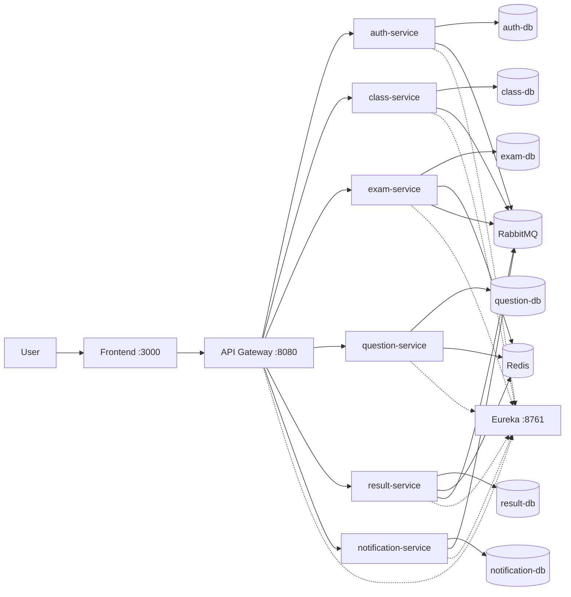

# System Architecture

> Completed **after** [Analysis and Design](analysis-and-design.md). Reflects the implemented E-Mid Quiz deployment.

**References:**
1. *Service-Oriented Architecture: Analysis and Design for Services and Microservices* — Thomas Erl (2nd Edition)
2. *Microservices Patterns: With Examples in Java* — Chris Richardson
3. *Bài tập — Phát triển phần mềm hướng dịch vụ* — Hung Dang (available in Vietnamese)

---

## 1. Pattern Selection

| Pattern | Selected? | Business / technical justification |
|---------|-----------|-----------------------------------|
| API Gateway | Có | Đóng vai trò là cổng vào duy nhất cho browser và clients; hỗ trợ xử lý JWT và CORS ở tầng tập trung; ẩn đi kết cấu bên trong của hệ thống microservices. |
| Database per Service | Có | Mỗi dịch vụ bị giới hạn sở hữu một kiến trúc schema MySQL riêng (`auth-db`, `exam-db`, `question-db`, `result-db`, `class-db`, `notification-db`). |
| Shared Database | Không | Bỏ qua việc dùng chung Database để tránh tình trạng kết nối chéo chặt chẽ (tight coupling) và đụng độ phiên bản SQL giữa các module. |
| Saga | Không (không chính thức) | Tính nhất quán giữa các dịch vụ dựa vào Eventual Consistency qua RabbitMQ kèm theo các gọi đồng bộ (sync); không có thành phần Saga Orchestrator treo chờ lâu. |
| Event-driven / Message Queue | Có | RabbitMQ cho các luồng sự kiện `exam.created`, `exam.submitted`, thông tin lớp, user đăng ký → sau đó **notification-service** sẽ đọc log và hiện thông báo/email. |
| CQRS | Không | Luồng xử lý đọc/ghi truy xuất chung từ một nguồn mẫu (models); Redis ở đây chủ yếu cho cache/session/idempotent, không phải làm query store chuyên biệt. |
| Circuit Breaker | Có | Sử dụng Resilience4j (ví dụ đường dẫn exam ↔ class/question, result ↔ exam) để tránh sụp đổ rầm rộ hệ thống khi server chịu tải hay rớt mạng (slow/down). |
| Service Registry / Discovery | Có | Tích hợp **Eureka**; giúp Gateway và các Feign Client nhận diện IP trạm trung chuyển `lb://service-name`. |
| Other: Redis | Có | Lưu trữ dữ liệu bộ nhớ đệm trạng thái kỳ thi, đệm kho câu hỏi, cấu trúc mã vạch (idempotent keys) đảm bảo nộp bài an toàn. |

---

## 2. System Components

| Component | Responsibility | Tech stack | Port (typical `.env`) |
|-----------|----------------|------------|------------------------|
| **Frontend** | SPA: lớp học, bài thi, ngân hàng câu hỏi, kết quả, hệ thống thông báo | React 18, Vite, nginx (Docker) | 3000 → container 3000 |
| **API Gateway** | Định tuyến `/api/*`, ghi đè sang `/api/v1/*`, kiểm tra JWT, CORS | Spring Cloud Gateway (WebFlux), Eureka client | 8080 |
| **Eureka Server** | Máy chủ đăng ký và tra cứu dịc vụ | Spring Cloud Netflix Eureka | 8761 |
| **Auth Service** | Đăng ký, nhận email xác minh, đăng nhập JWT, tra cứu người dùng | Spring Boot 3, JPA, MySQL | 8081 (host); internal 8081 |
| **Class Service** | Trục lớp học, mã tham gia, thành viên và các nhóm sự kiện lớp | Spring Boot 3, JPA, MySQL, RabbitMQ | 8087 (internal) |
| **Exam Service** | Quản lý trạng thái xuất bản, lấy lượt thi khởi động, kèm câu hỏi | Spring Boot 3, JPA, MySQL, Redis, RabbitMQ, Feign | 8082 (internal) |
| **Question Service** | Kiểm soát kho câu hỏi, import, AI sinh, cung cấp đáp án chấm tự động | Spring Boot 3, JPA, MySQL, Redis, Feign | 8083 (internal) |
| **Result Service** | Thu nhận câu trả lời, tính điểm số, xuất lỗi vi phạm, file CSV chấm công, kích hoạt `exam.submitted` | Spring Boot 3, JPA, MySQL, Redis, RabbitMQ, Feign | 8084 (internal) |
| **Notification Service** | Thông báo chuông in-app, cảnh báo email (chờ), và các trình tiêu thụ sự kiện khác | Spring Boot 3, JPA, MySQL, RabbitMQ, Mail | 8086 (internal) |
| **Redis** | Lưu trữ cache, lượt session, tính toàn vẹn | Redis 7 | 6379 |
| **RabbitMQ** | Hệ thống trục trặc thông điệp, bất đồng bộ tích hợp ngang | RabbitMQ 3 (management UI) | 5672 / 15672 |

> Các dịch vụ chỉ truy cập mạng lưới cục bộ (Internal-only services) sẽ phải qua tầng **gateway** thông tiếp mạng lưới với các trình duyệt. Dịch vụ mở thẳng host (direct host ports) chủ yếu dùng cấp quyền **auth** (8081) và lớp API **gateway** (8080) được gán default compose tĩnh, kết hợp quyền đăng nhập Database/Redis/RabbitMQ lúc sửa lỗi hệ thống (ops).

---

## 3. Communication

### 3.1 Inter-service communication matrix

Ghi chú (Legend): **H** tương tác HTTP (sync), **Feign** lấy tuyến qua Eureka server, **MQ** định dạng RabbitMQ push/pull, **DB** máy lưu trữ database cơ sở, **—** chưa có giao tiếp (no direct path).

| From → To | Auth | Class | Exam | Question | Result | Notification | Gateway | Redis | RabbitMQ |
|-----------|------|-------|------|----------|--------|--------------|---------|-------|----------|
| **Browser / FE** | — | — | — | — | — | — | **H** | — | — |
| **Gateway** | **H** (lb) | **H** | **H** | **H** | **H** | **H** | — | — | — |
| **Exam** | — | **Feign** | — | **Feign** | — | — | — | **H** | **MQ** publish |
| **Question** | — | — | — | — | — | — | — | **H** | — |
| **Result** | — | — | **Feign** | **Feign** | — | — | — | **H** | **MQ** publish |
| **Class** | — | — | — | — | — | — | — | — | **MQ** publish |
| **Notification** | — | — | — | — | — | — | — | — | **MQ** consume |
| **Auth** | — | — | — | — | — | — | — | — | **MQ** publish (user registered) |

Mỗi mô-đun hàng ngang độc lập dùng **duy nhất kho MySQL của nó** để persist (tính chất database-per-service).

---

## 4. Architecture Diagram

---

## 5. Deployment

- Toàn bộ các dịch vụ được **container hóa**; triển khai qua hệ thống dàn xếp **Docker Compose** (`docker compose up --build`).
- Cấu hình nạp bằng file **`.env`** (điều chỉnh từ mẫu `.env.example`); mọi khóa bí mật (secrets) không được đưa lên mã nguồn (commit).
- Kiểm tra tính sống (Health): toàn bộ app được mở cổng **`GET /health`** → `{"status":"ok"}`; riêng gateway tận dụng base của **`/actuator/health`**.
- Gọi chép qua lại nội bộ (Inter-container) sẽ gọi trỏ qua **Tên Compose DNS** (`auth-service`, `exam-service`, …), không sử dụng IP là `localhost`.
